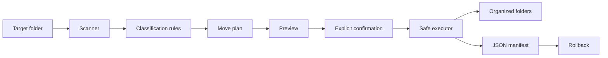

# Python Safe File Organizer

A practical **YourCloudDude** project for learning how to build a safer Python automation tool—not just a script that moves files.

The organizer scans one folder, classifies files by extension, previews the plan, avoids filename collisions, records every move in a manifest, and can roll the operation back.

## Why this project exists

A beginner file organizer often jumps straight from:

```text
read files -> move files
```

That works until a filename already exists, the wrong directory is selected, or you need to undo the operation.

This project adds the engineering controls that make automation safer:

- preview before mutation
- explicit confirmation before moving files
- collision-safe destination names
- rollback using an operation manifest
- hidden-file protection
- tests around failure-prone behavior
- linting and CI

## What you will learn

- `pathlib` for cross-platform file-system work
- `dataclasses` for modeling planned operations
- separation of planning and execution
- defensive file moves with `shutil`
- collision handling without overwriting existing files
- JSON manifests for traceability and rollback
- CLI design with `argparse`
- testing file-system automation with `pytest`
- automated quality checks with GitHub Actions

## Architecture



The most important design decision is that **planning is separate from execution**. You can inspect what the program intends to do before it changes the file system.

## Project structure

```text
.
├── .github/workflows/ci.yml
├── docs/
│   ├── design.md
│   └── troubleshooting.md
├── src/file_organizer/
│   ├── __init__.py
│   ├── cli.py
│   ├── config.py
│   ├── executor.py
│   └── planner.py
├── tests/
│   └── test_organizer.py
├── .gitignore
├── CONTRIBUTING.md
├── pyproject.toml
└── requirements-dev.txt
```

## Safety model

This tool deliberately refuses to make file changes unless you explicitly use `--yes`.

The recommended workflow is:

```text
plan -> inspect -> apply --yes -> keep manifest -> undo if needed
```

For your first test, use a temporary folder with copied files rather than an important Downloads or Documents directory.

## Install

Requires Python 3.11+.

```bash
git clone https://github.com/yourclouddude/python-safe-file-organizer.git
cd python-safe-file-organizer

python -m venv .venv
```

Activate the virtual environment, then install:

```bash
pip install -r requirements-dev.txt
pip install -e .
```

## Preview a plan

Nothing is changed:

```bash
file-organizer plan ~/Downloads
```

Example:

```text
expenses.csv -> Data/expenses.csv
photo.png -> Images/photo.png
resume.pdf -> Documents/resume.pdf
backup.zip -> Archives/backup.zip
```

## Apply the plan

First preview it. Then:

```bash
file-organizer apply ~/Downloads --yes
```

The organizer writes a manifest at:

```text
~/Downloads/.file-organizer-manifest.json
```

That manifest records the original and destination path for every completed move.

## Undo

```bash
file-organizer undo ~/Downloads/.file-organizer-manifest.json --yes
```

Rollback will not overwrite a new file that already exists at the original path. It stops with an error instead.

## Default categories

| Category | Example extensions |
|---|---|
| Documents | `.pdf`, `.docx`, `.txt`, `.md` |
| Images | `.jpg`, `.png`, `.webp`, `.svg` |
| Data | `.csv`, `.json`, `.xlsx`, `.parquet` |
| Archives | `.zip`, `.tar`, `.gz`, `.7z` |
| Code | `.py`, `.js`, `.ts`, `.java`, `.sql` |
| Audio | `.mp3`, `.wav`, `.flac` |
| Video | `.mp4`, `.mov`, `.mkv`, `.webm` |
| Other | anything unmatched |

Edit `src/file_organizer/config.py` to experiment with the rules.

## Collision handling

If this exists:

```text
Documents/report.pdf
```

and another `report.pdf` needs to move there, the organizer chooses:

```text
Documents/report (1).pdf
```

instead of overwriting the existing file.

If that also exists, it continues with `(2)`, `(3)`, and so on.

## Why hidden files are skipped

Files beginning with `.` are ignored by default.

Hidden files often include tool configuration or operating-system metadata. A generic organizer should not move those casually.

## Failure behavior

`apply_plan()` tracks completed moves. If a later move fails during the same run, it attempts to restore moves already completed in that operation before re-raising the error.

This is not a full transactional file system, but it demonstrates an important automation principle:

> when an operation can partially fail, design for partial failure explicitly.

## Run quality checks

```bash
python -m ruff check src tests
python -m compileall -q src tests
python -m pytest
```

GitHub Actions runs the same checks on pushes and pull requests.

## Tests included

The test suite covers:

- correct classification
- ignoring hidden files and directories
- collision-safe renaming
- applying a plan
- writing a manifest
- successful rollback
- refusing destructive rollback overwrites
- missing-directory handling
- CLI confirmation safety
- preview mode making no changes

## Engineering decisions

### Why not move files while scanning?

Because planning first makes the behavior observable and testable. It also gives a user the chance to inspect the proposed changes.

### Why a manifest instead of relying on memory?

Automation should leave evidence of what it changed. A manifest makes rollback deterministic and provides a useful audit trail.

### Why not overwrite collisions?

Silent overwrites are unacceptable for a learning automation tool. Preserving both files is safer.

### Why non-recursive by default?

Recursive file organization can unexpectedly restructure an entire directory tree. This first version intentionally limits the blast radius.

## Production-quality extensions

Try these after you understand the base project:

1. Load custom categories from TOML or YAML.
2. Add `--recursive` with explicit guardrails.
3. Add file-size or date-based organization rules.
4. Add structured logging.
5. Add hash-based duplicate detection.
6. Add a quarantine mode for suspicious extensions.
7. Add interactive confirmation instead of only `--yes`.
8. Add a Tkinter or web interface on top of the same planner/executor core.
9. Add a scheduled automation mode.
10. Package and publish the CLI after choosing an appropriate open-source license.

## Interview questions to practice

1. Why separate planning from execution?
2. How do you prevent accidental overwrites?
3. What happens if the third file move fails after two succeeded?
4. Why is rollback not equivalent to a database transaction?
5. How would you make the tool safe for recursive organization?
6. Why use `pathlib` instead of manual path strings?
7. How would you test file operations without touching real user files?
8. What race conditions could still exist?
9. How would you support very large directories efficiently?
10. How would you add configuration without tightly coupling it to execution?

## Troubleshooting

See [`docs/troubleshooting.md`](docs/troubleshooting.md).

For the deeper design discussion, see [`docs/design.md`](docs/design.md).

## About YourCloudDude

**YourCloudDude** creates practical AWS, cloud, and Python learning resources focused on learning by building.

Website: https://yourclouddude.com/

---

Build the project, test it on disposable files, then extend it. The goal is not only to automate a folder—it is to learn how to design automation that is **observable, reversible, and safer by default**.
