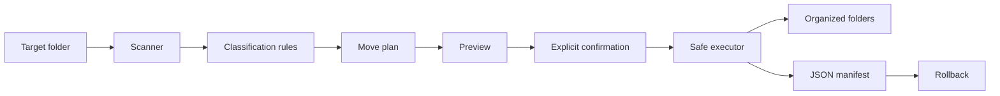

<div align="center">


**A file organizer built around a safer automation rule: decide what should happen before changing the filesystem.**

[](https://github.com/yourclouddude)
[](https://yourclouddude.com/)

</div>

---

## Why this project exists

Most file-organizer scripts are easy to write—and that is exactly why they are easy to get wrong.

A script that immediately moves everything works until a filename already exists, the wrong folder is selected, or the fifth move fails after the first four have already happened.

This project treats the sorting itself as the easy part. The useful engineering is making automation **previewable, collision-safe, traceable, and reversible**.

## The core rule

> **Do not change the filesystem while you are still deciding what to do.**



<div align="center">

`plan → inspect → apply --yes → keep manifest → undo if needed`

</div>

For a first run, use a temporary directory containing copied files. Do not test file automation for the first time on important data.

## Safety model at a glance

| Risk | Project response |
|---|---|
| Moving the wrong files | Read-only planning phase first |
| Overwriting an existing file | Collision-safe destination naming |
| Partial execution failure | Best-effort rollback of completed moves |
| Losing track of changes | Durable JSON manifest |
| Dangerous undo | Refuses to overwrite during rollback |
| Excessive blast radius | Non-recursive by default; hidden files skipped |
| Accidental mutation | Explicit `--yes` required |

## Install

Requires Python 3.11+.

```bash
git clone https://github.com/yourclouddude/python-safe-file-organizer.git
cd python-safe-file-organizer
python -m venv .venv
pip install -r requirements-dev.txt
pip install -e .
```

## 1. Preview a plan

```bash
file-organizer plan ~/Downloads
```

`plan` does not move anything. It scans the directory, applies classification rules, resolves destination names, and shows what would happen.

Example:

```text
expenses.csv -> Data/expenses.csv
photo.png -> Images/photo.png
resume.pdf -> Documents/resume.pdf
backup.zip -> Archives/backup.zip
```

If the plan is wrong, stop there. That is the point of separating planning from execution.

## 2. Apply only after inspection

```bash
file-organizer apply ~/Downloads --yes
```

The explicit `--yes` is deliberate. A command should not quietly turn a preview workflow into filesystem mutation.

After a successful operation, the organizer writes:

```text
~/Downloads/.file-organizer-manifest.json
```

The manifest records every completed move and becomes the source of truth for rollback.

## Collision handling

Suppose this already exists:

```text
Documents/report.pdf
```

Moving another `report.pdf` into that directory must not destroy the existing file. The organizer chooses a safe destination instead:

```text
Documents/report (1).pdf
```

If that exists too, it tries `(2)`, `(3)`, and so on.

Preserving user data matters more than creating the prettiest filename.

## Rollback has safety rules too

Undo a previous operation with:

```bash
file-organizer undo ~/Downloads/.file-organizer-manifest.json --yes
```

Rollback refuses to overwrite a new file that now exists at an original path. It stops instead.

If `apply_plan()` completes some moves and a later move fails during the same run, it attempts to restore the already completed moves before re-raising the error.

This is not a transactional filesystem, and the project does not pretend otherwise. The lesson is simpler:

> If an operation can partially succeed, define what partial failure means before it happens.

## Why hidden files and recursion are restricted

Files beginning with `.` are skipped by default because they may represent configuration, repository metadata, or operating-system state rather than ordinary user content.

The organizer is also non-recursive by default. Reorganizing one directory is easier to inspect and recover than unexpectedly restructuring an entire tree.

These restrictions intentionally keep the blast radius small.

## Built-in categories

| Category | Example extensions |
|---|---|
| Documents | `.pdf`, `.docx`, `.txt`, `.md` |
| Images | `.jpg`, `.png`, `.webp`, `.svg` |
| Data | `.csv`, `.json`, `.xlsx`, `.parquet` |
| Archives | `.zip`, `.tar`, `.gz`, `.7z` |
| Code | `.py`, `.js`, `.ts`, `.java`, `.sql` |
| Audio | `.mp3`, `.wav`, `.flac` |
| Video | `.mp4`, `.mov`, `.mkv`, `.webm` |
| Other | Anything unmatched |

Rules live in `src/file_organizer/config.py`, so classification can evolve without rewriting the planner and executor.

## Run the checks

```bash
python -m ruff check src tests
python -m compileall -q src tests
python -m pytest
```

GitHub Actions runs the same checks on pushes and pull requests.

Tests focus on the failure-prone parts of automation: classification, hidden files, collision-safe naming, preview behavior, manifest creation, rollback, refusal to overwrite during rollback, missing directories, and CLI confirmation.

## Design decisions worth reading in the code

### Planner and executor are separate

The planner answers **what should happen?** The executor answers **make this already-reviewed plan happen.** That makes preview mode real instead of cosmetic and makes both pieces easier to test.

### The manifest is a product feature

Without a durable record of completed moves, rollback would have to guess. The manifest makes every mutation traceable.

### Collision handling is intentionally conservative

The tool never chooses silent replacement. Convenience does not justify accidental data loss.

### Power is added slowly

No recursive traversal by default, hidden files skipped, and mutation requires explicit confirmation. Those limitations make the behavior easier to understand before adding more capability.

## What this tool does not promise

This is not a replacement for backups, snapshots, or a transactional filesystem.

Races are still possible if another process changes files between planning and execution. A machine crash can interrupt operations outside the Python process. A manifest cannot recover content deleted by unrelated software.

Having an undo command is not the same as guaranteeing that data can never be lost.

## Experiments to try next

1. Add `--recursive` and define explicit exclusion rules.
2. Load categories from TOML or YAML.
3. Add hash-based duplicate detection and define skip/move/quarantine behavior.
4. Add per-file confirmation for high-risk operations.
5. Add structured logging for failed and rolled-back operations.
6. Add scheduling only after defining what unattended confirmation means.

A GUI can come later; the planner/executor boundary should survive underneath it.

## Questions you should be able to answer

- Why is planning separate from execution?
- What prevents destination files from being overwritten?
- What happens if several moves succeed and a later one fails?
- Why is rollback not equivalent to a database transaction?
- What new risks appear with recursion?
- How can file operations be tested without touching real user data?
- What can change between preview and execution?

## Repository map

```text
.
├── .github/workflows/ci.yml
├── docs/
│   ├── design.md
│   └── troubleshooting.md
├── src/file_organizer/
│   ├── __init__.py
│   ├── cli.py
│   ├── config.py
│   ├── executor.py
│   └── planner.py
├── tests/
│   └── test_organizer.py
├── CONTRIBUTING.md
├── pyproject.toml
└── requirements-dev.txt
```

For implementation details, see [`docs/design.md`](docs/design.md). For common issues, see [`docs/troubleshooting.md`](docs/troubleshooting.md).

---

<div align="center">

### YourCloudDude

**Build automation that is useful because it is understandable—and safer because its failure modes are explicit.**

[](https://yourclouddude.com/)


</div>