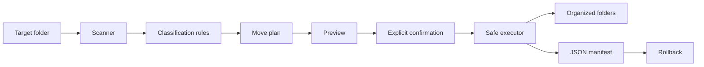

# Python Safe File Organizer

Most file-organizer scripts are easy to write.

That is also what makes them easy to get wrong.

A script that immediately moves everything it finds works right up until a filename already exists, the wrong folder is selected, or the fifth move fails after the first four already happened.

This project is about that gap. The file sorting is simple. The useful part is learning how to make automation **previewable, collision-safe, traceable, and reversible**.

## The rule this project starts with

**Do not change the file system while you are still deciding what to do.**

The organizer separates planning from execution:



That means you can inspect the intended changes before a file moves.

The normal workflow is:

```text
plan → inspect → apply --yes → keep the manifest → undo if needed
```

For a first run, use a temporary folder containing copied files. Do not test file automation for the first time on something important.

## Install it

Requires Python 3.11+.

```bash
git clone https://github.com/yourclouddude/python-safe-file-organizer.git
cd python-safe-file-organizer
python -m venv .venv
```

Activate the virtual environment, then install the project and development tools:

```bash
pip install -r requirements-dev.txt
pip install -e .
```

## Start with a plan

```bash
file-organizer plan ~/Downloads
```

`plan` does not move anything. It scans the target directory, applies the classification rules, resolves destination names, and prints what would happen.

A preview can look like this:

```text
expenses.csv -> Data/expenses.csv
photo.png -> Images/photo.png
resume.pdf -> Documents/resume.pdf
backup.zip -> Archives/backup.zip
```

If the plan is wrong, stop there. That is the point of having a planning phase.

## Apply only after you have seen the plan

```bash
file-organizer apply ~/Downloads --yes
```

The explicit `--yes` is deliberate. The command should not quietly turn a read-only-looking experiment into a batch of file-system mutations.

After a successful operation, the organizer writes:

```text
~/Downloads/.file-organizer-manifest.json
```

The manifest records where each completed file came from and where it went. It is both an audit trail and the input for rollback.

## What happens when a filename already exists?

Suppose this file is already present:

```text
Documents/report.pdf
```

Moving another `report.pdf` into that directory must not silently destroy the first one. The organizer picks a new name instead:

```text
Documents/report (1).pdf
```

If that is taken too, it tries `(2)`, `(3)`, and so on.

For this project, preserving both files is more important than producing the prettiest destination name.

## Rollback has rules too

To undo an operation:

```bash
file-organizer undo ~/Downloads/.file-organizer-manifest.json --yes
```

Rollback is not allowed to overwrite a new file that now exists at an original path. It stops instead.

That matters because "undo" should not become a second destructive operation.

There is another failure case worth noticing. If `apply_plan()` completes some moves and a later move fails during the same run, it attempts to restore the moves already completed before re-raising the error.

This is not a transactional file system, and the project does not claim that it is. It demonstrates a more practical rule:

> If an operation can partially succeed, decide what partial failure should mean before it happens.

## Why hidden files are left alone

Files beginning with `.` are skipped by default.

A generic organizer cannot safely assume that hidden files are disposable user content. They may be application configuration, repository metadata, or operating-system files. Moving them would increase the blast radius for very little learning value.

The project is also non-recursive by default for the same reason. Reorganizing one directory is easier to inspect and recover than unexpectedly restructuring an entire tree.

## The built-in categories

| Category | Example extensions |
|---|---|
| Documents | `.pdf`, `.docx`, `.txt`, `.md` |
| Images | `.jpg`, `.png`, `.webp`, `.svg` |
| Data | `.csv`, `.json`, `.xlsx`, `.parquet` |
| Archives | `.zip`, `.tar`, `.gz`, `.7z` |
| Code | `.py`, `.js`, `.ts`, `.java`, `.sql` |
| Audio | `.mp3`, `.wav`, `.flac` |
| Video | `.mp4`, `.mov`, `.mkv`, `.webm` |
| Other | anything unmatched |

The rules live in `src/file_organizer/config.py`. Changing them is a useful exercise because the planner and executor do not need to be rewritten just because classification changes.

## Run the checks

```bash
python -m ruff check src tests
python -m compileall -q src tests
python -m pytest
```

GitHub Actions runs the same quality checks on pushes and pull requests.

The tests focus on the places where file automation usually becomes unsafe rather than just checking that a happy-path move works. They cover classification, hidden files, collision-safe naming, preview behavior, manifest creation, rollback, refusal to overwrite during rollback, missing directories, and CLI confirmation.

## A few decisions worth reading in the code

### Planner and executor are separate

The planner answers "what should happen?" The executor answers "make this already-reviewed plan happen." Keeping those jobs separate makes preview mode real rather than cosmetic and keeps the core behavior easier to test.

### The manifest is part of the design, not debug output

Without a durable record of completed moves, rollback would have to guess. The manifest makes the operation traceable and gives undo a concrete source of truth.

### Collision handling is intentionally conservative

The tool never chooses silent replacement. A convenience script should not get permission to destroy data merely because two files share a name.

### The first version keeps the blast radius small

No recursive traversal by default, hidden files skipped, and mutation requires explicit confirmation. Those restrictions can feel inconvenient, but they make the behavior easier to understand before adding more power.

## What this tool does not promise

It is not a replacement for backups, snapshots, or a transactional file system.

Races are still possible if another process changes files between planning and execution. A machine crash can interrupt work outside the Python process. A manifest cannot restore content that some unrelated program deletes.

Those limits are useful to understand because "has an undo command" is not the same as "cannot lose data."

## Experiments that actually change the design

Once the base workflow makes sense, try changes that force you to think about safety again:

1. add `--recursive`, then define how deep it may go and what should be excluded
2. load categories from TOML or YAML without coupling configuration to execution
3. add hash-based duplicate detection and decide whether duplicates should move, skip, or quarantine
4. add interactive confirmation for individual high-risk moves
5. add structured logging and make failed/rolled-back operations easier to inspect
6. add scheduling only after deciding what unattended confirmation should mean

A GUI can be added later, but the planner/executor boundary should survive underneath it.

## Questions worth being able to answer

- Why is planning separate from execution?
- What prevents an existing destination file from being overwritten?
- What happens if several moves succeed and a later one fails?
- Why is rollback not equivalent to a database transaction?
- What new risks appear if recursive mode is added?
- How would you test file operations without touching real user files?
- What can still change between preview and execution?

## Repository map

```text
.
├── .github/workflows/ci.yml
├── docs/
│   ├── design.md
│   └── troubleshooting.md
├── src/file_organizer/
│   ├── __init__.py
│   ├── cli.py
│   ├── config.py
│   ├── executor.py
│   └── planner.py
├── tests/
│   └── test_organizer.py
├── .gitignore
├── CONTRIBUTING.md
├── pyproject.toml
└── requirements-dev.txt
```

For implementation details, see [`docs/design.md`](docs/design.md). For common problems, see [`docs/troubleshooting.md`](docs/troubleshooting.md).

## YourCloudDude

YourCloudDude builds practical AWS, cloud, and Python projects for people who learn best by building, breaking, inspecting, and improving real systems.

Website: https://yourclouddude.com/
