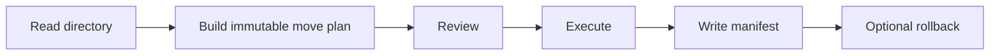

# Design Notes

This document explains the engineering choices behind the YourCloudDude Python Safe File Organizer.

## Core principle

The system uses two phases:

The planner does not mutate the file system. The executor receives an explicit list of moves.

That separation makes the behavior easier to reason about, test, log, and eventually expose through other interfaces.

## Planning

`build_plan()`:

1. resolves the target directory
2. rejects missing or non-directory paths
3. scans only direct child files
4. skips hidden files
5. classifies each suffix
6. computes a collision-safe destination
7. returns `MoveOperation` objects

Destination paths are reserved while the plan is being built so two source files cannot accidentally receive the same planned destination.

## Execution

`apply_plan()` creates destination directories only when execution begins.

Completed operations are tracked. If a later move raises an exception, completed moves are attempted in reverse order to reduce partial-change damage.

A successful run writes a JSON manifest.

## Rollback

Rollback reads the manifest from newest move to oldest move.

It restores a file only when:

- the moved destination still exists
- the original source path does not already exist

If the source path exists again, rollback raises instead of overwriting it.

## Deliberate limitations

The current version is:

- non-recursive
- extension-based
- single-process
- local-file-system only
- not a duplicate detector
- not designed as a backup system

These limits are deliberate. Learners should understand the safety model before increasing the blast radius.

## Race conditions

The plan can become stale between preview and execution. Another process could create or remove a file after planning.

A more advanced version could revalidate each operation immediately before moving it and record richer failure metadata.

## Why JSON?

JSON keeps the manifest transparent. Learners can open the file and inspect exactly what changed without a custom database or binary format.

## Testing strategy

Tests use pytest temporary directories. This isolates each scenario and prevents the test suite from touching real user files.

The most important tests focus on destructive-risk boundaries: collisions, rollback, confirmation, and preview-only behavior.
